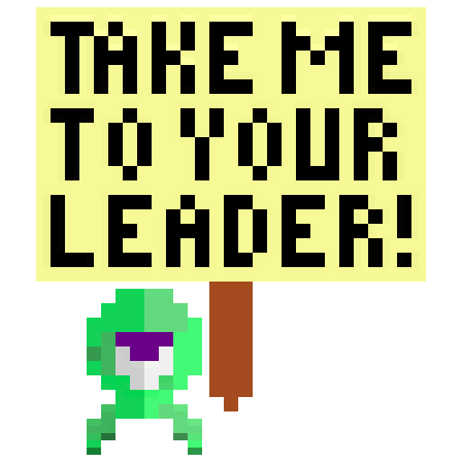
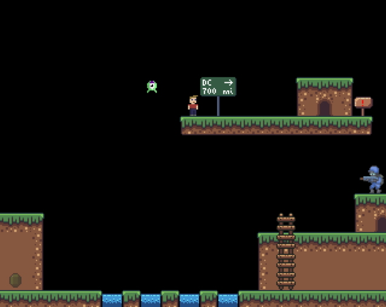

  

<!-- # Take Me To Your Leader -->

A [libgdx](https://libgdx.com/) platformer written in a week in
[Scala](https://www.scala-lang.org/) for
[Brackeys Game Jam 2022.2](https://itch.io/jam/brackeys-8).

Help Doofus bring his new alien pal from Roswell, New Mexico,
to meet the president in Washington, DC.

## Build

`./gradlew desktop:dist` → `desktop/build/libs/[appname]-[version].jar`

`./gradlew desktop:jpackage` → `desktop/build/dist/[appname]-[version]-[arch].dmg` (OS X)

## License

[Apache License, Version 2.0](LICENSE.md)

## Credits

1. Audio editing with [Audacity](https://www.audacityteam.org/)
2. Vector editing with [Inkscape](https://inkscape.org/)
3. Pixel editing with [Gimp](https://www.gimp.org/) and [Piskel](https://www.piskelapp.com/)
4. Level editing with [Ogmo Editor](https://ogmo-editor-3.github.io/)
5. Code editing with [IntelliJ IDEA](https://www.jetbrains.com/idea/)
6. Android icon with [Icon Kitchen](https://icon.kitchen/)
7. Pixel assets from
   [korba](https://opengameart.org/content/alien-2d-sprites),
   [rottingpixels](https://rottingpixels.itch.io/nature-platformer-tileset),
   [pzuh](https://pzuh.itch.io/free-desert-platformer-tileset),
   [sanctumpixel](https://sanctumpixel.itch.io/fire-column-pixel-art-effect),
   [xyezawr](https://xyezawr.itch.io/gif-free-pixel-effects-pack-5-blood-effects),
   [secrethideout](https://secrethideout.itch.io/team-wars-platformer-battle),
   [didigameboy](https://didigameboy.itch.io/jambo-jungle-free-sprites-asset-pack)
   <!-- tiny adventurer? -->
8. Sound assets from
   [hykenfreak](https://freesound.org/people/hykenfreak/sounds/331621/),
   [qubodup](https://freesound.org/people/qubodup/sounds/162263/)